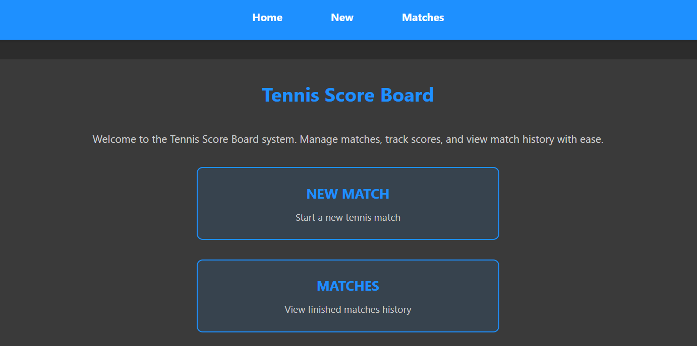
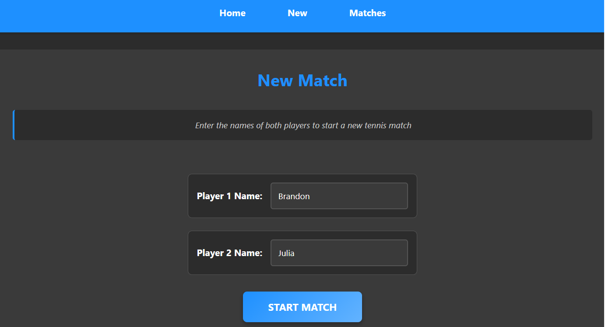
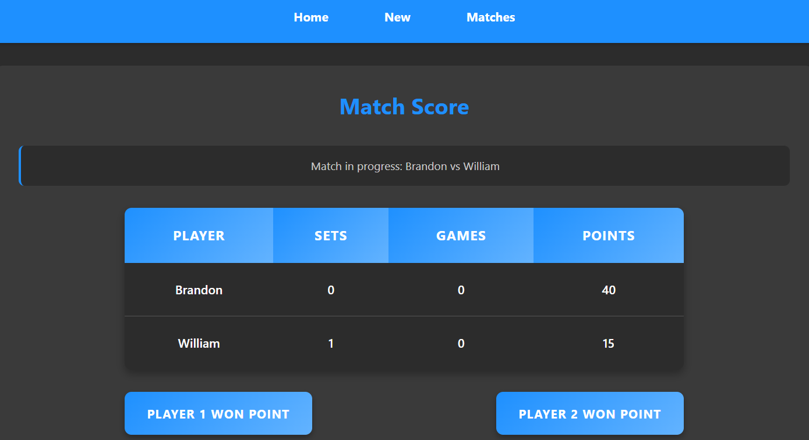
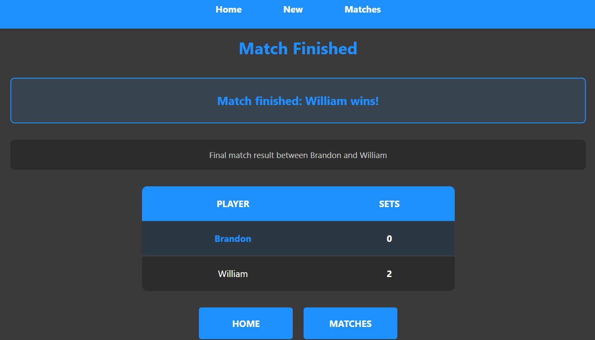
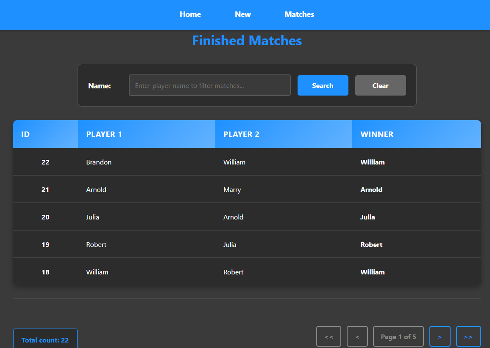

# Табло теннисного матча
Веб-приложение, реализующее табло счёта теннисного матча.

Это четвёртый проект из Java Роадмап Сергея Жукова https://zhukovsd.github.io/java-backend-learning-course/

---
## Возможности приложения
- Создание нового теннисного матча между двумя игроками;
- Изменение счёта игроков после каждого раунда;
- Просмотр результатов сыгранного матча;
- Просмотр истории всех сыгранных матчей, их победителей. 

---
## Пример пользовательского интерфейса

---
## Используемые технологии
- Java 17
- Jakarta Servlet (Jakarta EE)
- hibernate-core 6.4.4.Final
- H2 in memory database 2.2.224
- Apache Maven 3.4.0
- Apache Tomcat 11.0.6